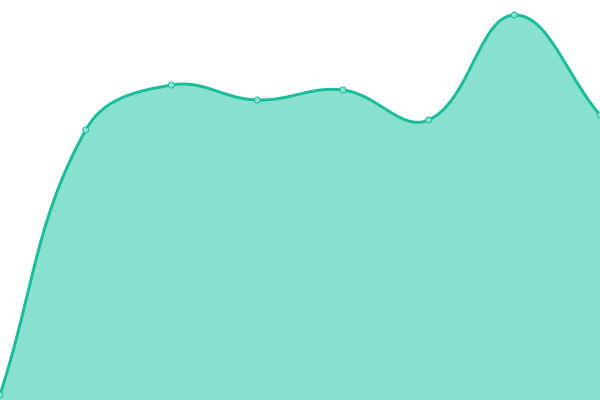
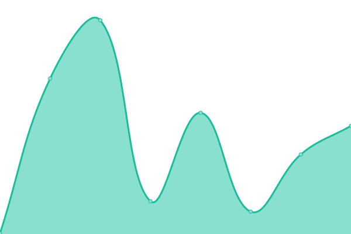
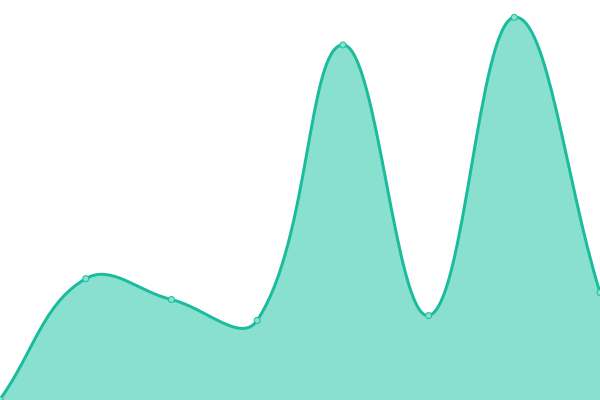
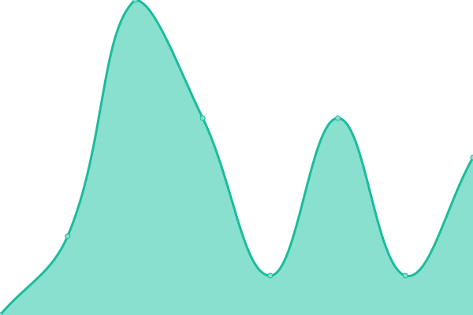

# [📈 Live Status](https://kitos9112.github.io/uptime): <!--live status--> **🟧 Partial outage**

This repository contains the open-source uptime monitor and status page for [Marcos Soutullo Rodriguez](https://kitos9112.github.io/uptime), powered by [Upptime](https://github.com/upptime/upptime).

With [Upptime](https://upptime.js.org), you can get your own unlimited and free uptime monitor and status page, powered entirely by a GitHub repository. We use [Issues](https://github.com/kitos9112/uptime/issues) as incident reports, [Actions](https://github.com/kitos9112/uptime/actions) as uptime monitors, and [Pages](https://kitos9112.github.io/uptime) for the status page.

<!--start: status pages-->
<!-- This summary is generated by Upptime (https://github.com/upptime/upptime) -->
<!-- Do not edit this manually, your changes will be overwritten -->
<!-- prettier-ignore -->
| URL | Status | History | Response Time | Uptime |
| --- | ------ | ------- | ------------- | ------ |
|  DMZ UK Home Website | 🟥 Down | [dmz-uk-home-website.yml](https://github.com/kitos9112/uptime/commits/HEAD/history/dmz-uk-home-website.yml) | 

 0ms
     
 | 

<a href="https://kitos9112.github.io/uptime/history/dmz-uk-home-website">0.00%</a>
    

|  HASS UK Home Website | 🟥 Down | [hass-uk-home-website.yml](https://github.com/kitos9112/uptime/commits/HEAD/history/hass-uk-home-website.yml) | 

 0ms
     
 | 

<a href="https://kitos9112.github.io/uptime/history/hass-uk-home-website">0.00%</a>
    

|  MOODLE BCN Home Website | 🟥 Down | [moodle-bcn-home-website.yml](https://github.com/kitos9112/uptime/commits/HEAD/history/moodle-bcn-home-website.yml) | 

 0ms
     
 | 

<a href="https://kitos9112.github.io/uptime/history/moodle-bcn-home-website">0.00%</a>
    

|  [Google Website](https://www.google.com) | 🟩 Up | [google-website.yml](https://github.com/kitos9112/uptime/commits/HEAD/history/google-website.yml) | 

 88ms
     
 | 

<a href="https://kitos9112.github.io/uptime/history/google-website">100.00%</a>
    

|  [Wikipedia Website](https://en.wikipedia.org) | 🟩 Up | [wikipedia-website.yml](https://github.com/kitos9112/uptime/commits/HEAD/history/wikipedia-website.yml) | 

 214ms
     
 | 

<a href="https://kitos9112.github.io/uptime/history/wikipedia-website">100.00%</a>
    

|  [Vinos Divertidos](https://vinosdivertidos.es) | 🟩 Up | [vinos-divertidos.yml](https://github.com/kitos9112/uptime/commits/HEAD/history/vinos-divertidos.yml) | 

 1238ms
     
 | 

<a href="https://kitos9112.github.io/uptime/history/vinos-divertidos">100.00%</a>
    

|  [Avance Import](https://avanceimport.com) | 🟩 Up | [avance-import.yml](https://github.com/kitos9112/uptime/commits/HEAD/history/avance-import.yml) | 

 1217ms
     
 | 

<a href="https://kitos9112.github.io/uptime/history/avance-import">100.00%</a>
    

|  [Vodafone Website](www.vodafone.com) | 🟩 Up | [vodafone-website.yml](https://github.com/kitos9112/uptime/commits/HEAD/history/vodafone-website.yml) | 

 642ms
     
 | 

<a href="https://kitos9112.github.io/uptime/history/vodafone-website">100.00%</a>
    

|  [Google DNS 1 TCP Probe](8.8.4.4) | 🟩 Up | [google-dns-1-tcp-probe.yml](https://github.com/kitos9112/uptime/commits/HEAD/history/google-dns-1-tcp-probe.yml) | 

 5ms
     
 | 

<a href="https://kitos9112.github.io/uptime/history/google-dns-1-tcp-probe">100.00%</a>
    

|  [Google DNS 2 TCP Probe](8.8.8.8) | 🟩 Up | [google-dns-2-tcp-probe.yml](https://github.com/kitos9112/uptime/commits/HEAD/history/google-dns-2-tcp-probe.yml) | 

 4ms
     
 | 

<a href="https://kitos9112.github.io/uptime/history/google-dns-2-tcp-probe">100.00%</a>
    

<!--end: status pages-->

[**Visit our status website →**](https://kitos9112.github.io/uptime)

## 📄 License

- Powered by: [Upptime](https://github.com/upptime/upptime)
- Code: [MIT](./LICENSE) © [Marcos Soutullo Rodriguez](https://kitos9112.github.io/uptime)
- Data in the `./history` directory: [Open Database License](https://opendatacommons.org/licenses/odbl/1-0/)
